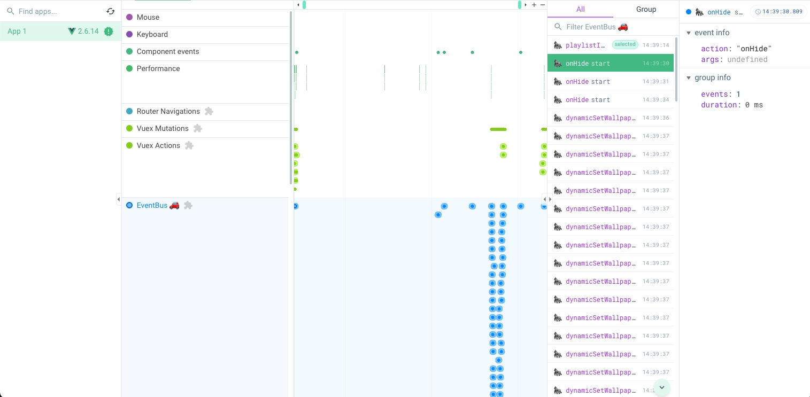

# vue-obs-eventbus

vue devtool listen on eventbus.

## getting start

If you are using Vue 2, you need to install a plugin and inject the created eventbus at the root of the app:

```ts
import Vue from 'vue'
import App from './App.vue'
import { createEventBusDevToolsPlugin, EventBusDevToolsVue2Plugin } from 'vue-obs-eventbus'

Vue.use(EventBusDevToolsVue2Plugin)

new Vue({
  eventbus: createEventBusDevToolsPlugin(),
  render: h => h(App),
})
```

If you are using Vue 3, you need to create a eventbus instance and pass it to the app as a plugin:

```ts
import { createApp } from 'vue'
import App from './App.vue'
import { createEventBusDevToolsPlugin } from "vue-obs-eventbus"

const eventbus = createEventBusDevToolsPlugin()

createApp(App).use(eventbus).mount('#app')
```

## create a eventbus

Define the event types into `createEventBus`.

```ts
import { createEventBus } from 'vue-obs-eventbus'

export const eventbus = createEventBus<{
  'hello': number
}>('default')
```

you can use the eventbus by direct.

```ts
import { eventbus } from "./eventbus"

eventbus.emit('hello', 1)

eventbus.on('hello', (data) => {
  console.log(data)
})
```

you also can hoist the eventbus into vue prototype.

```ts
// vue2
Vue.prototype.$eventBus = eventBus

// vue3
app.config.globalProperties.$eventBus = eventBus
```

and the use it by `this` in options api.

```ts
export default {
  methods: {
    emit(event, data) {
      this.$eventbus.emit(event, data)
    }
  }
}
```

after use the eventbus, vue-obs-eventbus will collect the `emit` event and log it in the `vue-devtools`


